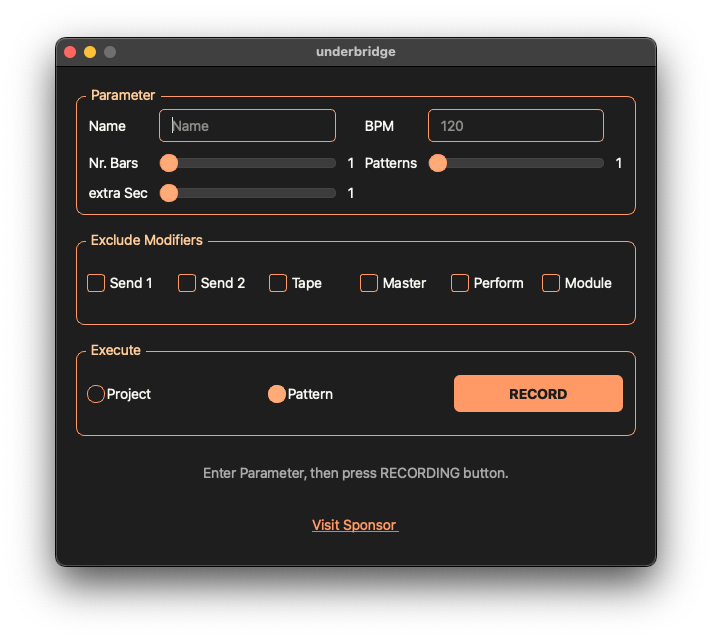

---

# Underbridge for OP-Z  
**Multitrack / Stem Exporter for OP-Z**

## Description

Exports patterns and projects as individual audio tracks to separate folders for use in your DAW.  
Built with Python, cross-platform, and includes a single-file binary for x86 Linux, Windows, and macOS.

---

## ✅ New in Version 1.4

- 🎨 **New Interface**: A more user-friendly and modern GUI.
- ✅ **Several Fixes**: Resolved known bugs, improved stability, better audio detection and handling.



### New Installation method 1.4:

- **Mac**: Run underbridge-light.app or move it to applications first.
- **Windows**: Extract zip file with all files to a writeable folder and run the underbridge-light.exe
- **Linux**: Extract zip file with all files to a writeable folder and make underbridge-light binary executable then run

---


## 🚀 Using the Packaged Single-File Binaries (The Easy Way) for Version prior 1.4

Executables are located in the `/dist/` folder or in the release tab.

- **Windows**: Run `underbridge.exe`
- **Linux**: Navigate to the folder where the binary is located and run:  
  ```bash
  ./underbridge
  ```
- **macOS**: Open a terminal, navigate to the folder containing `underbridge_mac`, and run:  
  ```bash
  chmod +x underbridge_mac && ./underbridge_mac
  ```
  *Tip:* If the app doesn't start, try:
  ```bash
  xattr -d com.apple.quarantine underbridge.app
  ```

> Note: There's also an alternative version (`underbridge_alt`) that may be useful if you run into issues, though it's outdated.

---

## 🛠️ Installation (The Less Easy Way)

### Windows

- Install **Python 3.9** if not already installed (Python 3.10 may cause issues).
- Install required packages:
  ```bash
  pip install mido rt-midi pipwin
  pipwin install pyaudio
  ```
- **Important Steps:**
  - Activate the OP-Z device as the default audio input in Windows Sound Settings.
  - Close all other applications that may use audio (e.g., browser, media players).
- Run:
  ```bash
  python underbridge.py
  ```

### macOS (Tested on macOS Monterey 12.3)

Install required packages via Homebrew and pip:

```bash
brew install portaudio python-tk
pip install mido python-rtmidi pyaudio
```

> If installing `pyaudio` fails with the error:  
> `"ERROR: Could not build wheels for pyaudio..."`, and you're on an M1 chip, follow additional instructions.

- Set OP-Z as the default audio input in **System Preferences > Sound**.
- Run:
  ```bash
  python3 underbridge.py
  ```

### Ubuntu 20.10 LTS

Install required system packages:

```bash
sudo apt install portaudio19-dev python3-tk
pip install python-rtmidi pyaudio
```

Then run:
```bash
python3 underbridge.py
```

---

## 📱 Steps to Use

1. Connect OP-Z via USB.
2. Run Underbridge.

---

## 🎯 Modes of Operation

### Single Pattern Mode

1. Select the pattern you want to export.
2. Enter a project name (used for folder structure).
3. Get BPM from LED code or smartphone app.
4. Enter BPM and longest bar of your track (1–4).
5. Optionally add extra seconds for reverb tails.
6. Select **Pattern Mode**.
7. Choose the directory to save tracks.
8. Click **Record** and wait for completion.

### Project Mode

1. Select the project and first pattern to export.
2. Enter a project name (used for folder structure).
3. Get BPM from LED code or smartphone app.
4. Enter BPM and longest bar of your track (1–4).
5. Enter the number of patterns in your song.
6. Optionally add extra seconds for reverb tails.
7. Select **Project Mode**.
8. Choose the directory to save tracks.
9. Click **Record** and wait for completion.

---

## 🛠️ Troubleshooting

- If your recorded audio contains buzzing or artifacts, try **disabling USB charging** on the OP-Z via the *"display"* and *"bottom right key"*.  
- If playback starts but no tracks are muted, ensure **MIDI IN** is enabled in the OP-Z app or via combo.

---
